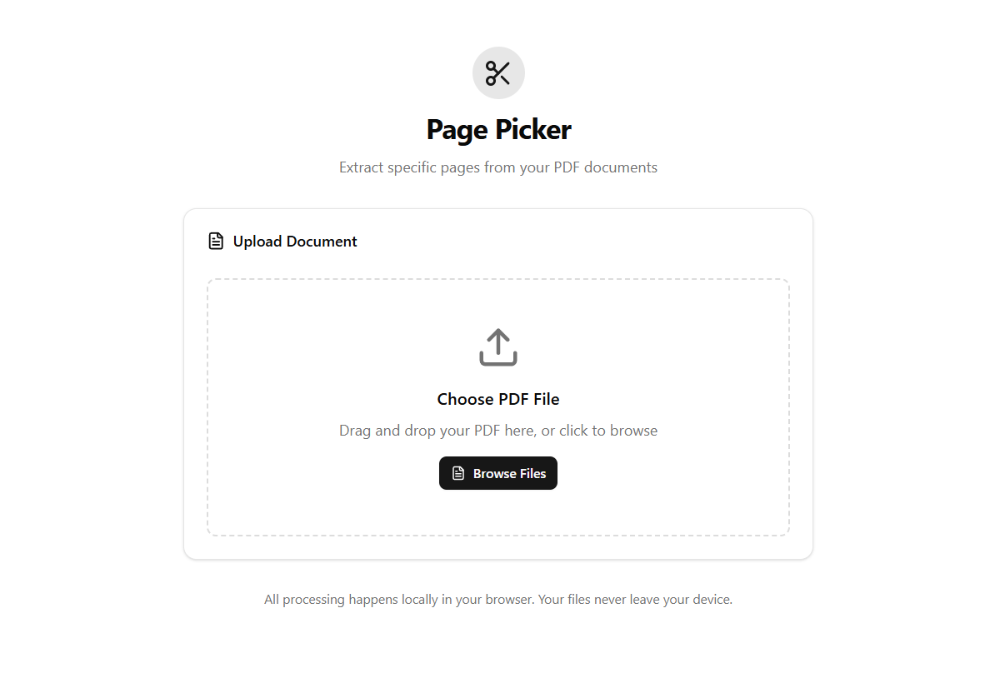

# 📄 Page Picker

A modern, sleek PDF page extraction tool built with Next.js and shadcn/ui. Extract specific pages from your PDF documents with an intuitive drag-and-drop interface.



## ✨ Features

- **🖱️ Drag & Drop Interface** - Simply drag your PDF files into the upload area
- **📋 Quick Page Selection** - Pre-built buttons for common selections (First Page, Last Page, All Pages, etc.)
- **🎯 Custom Range Selection** - Type specific page numbers for precise extraction
- **👀 Live Preview** - Side-by-side comparison of original and extracted PDF
- **💻 Client-Side Processing** - Your files never leave your device - all processing happens locally
- **📱 Responsive Design** - Works seamlessly on desktop, tablet, and mobile devices
- **🎨 Modern UI** - Clean, intuitive interface built with shadcn/ui components
- **⚡ Fast Performance** - Powered by pdf-lib for efficient PDF manipulation

## 🚀 Getting Started

### Prerequisites

- Node.js 18+ 
- npm or yarn

### Installation

1. Clone the repository:
```bash
git clone https://github.com/yourusername/page-picker.git
cd page-picker
```

2. Install dependencies:
```bash
npm install
# or
yarn install
```

3. Run the development server:
```bash
npm run dev
# or
yarn dev
```

4. Open [http://localhost:3000](http://localhost:3000) in your browser.

## 🛠️ Tech Stack

- **Framework**: [Next.js 15](https://nextjs.org/)
- **Language**: [TypeScript](https://www.typescriptlang.org/)
- **Styling**: [Tailwind CSS](https://tailwindcss.com/)
- **UI Components**: [shadcn/ui](https://ui.shadcn.com/)


## 📖 How to Use

1. **Upload PDF**: Drag and drop a PDF file onto the upload area, or click to browse
2. **Select Pages**: Choose from quick selection buttons or enter custom page ranges
3. **Preview**: Click "Preview & Extract" to see both original and extracted PDFs
4. **Download**: Click "Download Extracted PDF" to save your selection


## 🔒 Privacy & Security

- **100% Client-Side**: All PDF processing happens in your browser
- **No Server Upload**: Your files never leave your device
- **No Data Collection**: We don't store or track any of your documents
- **Local Processing**: Uses browser-native APIs for file handling


## 📄 License

This project is licensed under the MIT License - see the [LICENSE](LICENSE) file for details.


---

Made with ❤️ and modern web technologies

